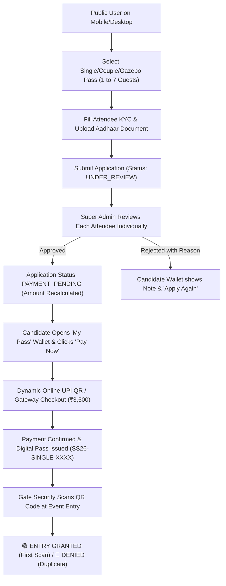

# 🏆 SAFED SHERI 2026 — MASTER ARCHITECTURAL & USER FLOW GUIDE

## 🌐 Live Client Mobile & Desktop Access
- **Public Client Web App (Mobile Optimized)**: [https://safedsheri2026.loca.lt](https://safedsheri2026.loca.lt)
- **Local Host URL**: [http://localhost:3000](http://localhost:3000)
- **Super Admin Terminal**: [http://localhost:3000/admin](http://localhost:3000/admin) *(User: `admin@safedsheri.com` | Pass: `AdminPass123!`)*
- **Box Office Cashier Terminal**: [http://localhost:3000/cashier](http://localhost:3000/cashier)
- **Security Gate Scanner**: [http://localhost:3000/security](http://localhost:3000/security)

---

## 📱 Mobile UI & Minimal Header Enhancements

### 1. Minimal Luxury Header
* **Removed Date Clutter**: "09 OCTOBER 2026" has been removed from beneath the navbar logo to ensure a clean, uncluttered aesthetic.
* **Unified Alignment**: The header features the circular emblem, `SAFED SHERI` wordmark, interactive sound toggle `[🔊]`, `My Pass` ticket button, and `Book Pass` action.
* **Mobile-Responsive Spacing**: Balanced padding (`px-3 sm:px-6`, `py-2.5 sm:py-3.5`) ensures no wrapping on 320px–430px mobile viewports.

---

### 2. 3D Cylindrical Sponsors & Brand Alliances
* **Real Vector Logos & Established Badges**: Replaced plain placeholders with custom luxury vector logos and authentic typography for all 8 official partners:
  1. **Jade Blue Lifestyle** — Official Luxury Ethnic Wear Partner (`EST. 1995`)
  2. **Club O7 Resort & Spa** — Grand Venue & Hospitality Partner (`EST. 2010`)
  3. **Wagh Bakri Tea Group** — Official Refreshment Partner (`EST. 1892`)
  4. **Havmor Gourmet** — Gourmet Dessert & Stalls Partner (`EST. 1944`)
  5. **Red FM 93.5** — Official Broadcast & Radio Partner (`AIRWAVES`)
  6. **Tanishq Jewellers** — Royal Gold & Diamond Partner (`ROYALTY`)
  7. **ICICI Bank** — Official Digital Payments & UPI Partner (`FINANCE`)
  8. **BMW Gallops Motors** — Official Luxury Mobility Partner (`MOTORS`)
* **Glassmorphism Backdrop**: Dual-tone gradient cards with smooth touch-drag and auto-rotation.

---

### 3. Clean Public Footer
* **Zero Staff/Admin Links**: Removed `Staff Login`, `Admin Portal`, `Cashier Desk`, and `Security Scanner` links from the public page footer.
* **Luxury Public Brand Footer**: Includes brand navigation links (`The Concept`, `75% White Rule`, `Gazebo Lounges`, `Brand Partners`, `Pass Privilege`), Club O7 venue details, and copyright.

---

### 4. Dynamic Pricing Sync & Concealment Engine
* **Instant Database Synchronization**: Fixed the initial static fallback issue by binding `fetchPricing()` inside a real-time interval hook. When Admin toggles prices **OFF** in the Admin Panel, the landing page updates automatically.
* **Concealed Pricing Badges**: When hidden, pass cards display a gold badge: `"✨ Price Revealed on Approval"` instead of raw amounts.

---

## 🔄 Complete End-to-End User Flow (Booking to Entry)

---

### Flow 1: Step-by-Step Attendee Registration (Carousel Wizard)
1. User clicks **"Book Pass"** and chooses pass quantity (1 to 7 guests).
2. The interactive carousel guides user attendee-by-attendee with live draft auto-save and document upload.
3. Form validates:
   - Mandatory 10-digit mobile number with `5-5` digit grouping (`98765 43210`).
   - 12-digit Aadhaar number with `4-4-4` grouping (`1234 5678 9012`).
   - Duplicate Aadhaar and active pass prevention.

---

### Flow 2: Super Admin Granular Review & Partial Approvals
1. Admin logs into the **Super Admin Terminal** ([http://localhost:3000/admin](http://localhost:3000/admin)).
2. In the Tabulator grid, Admin clicks **"Review"** on any pending booking.
3. In the **Executive KYC Review Modal**:
   - Admin views the uploaded Aadhaar document directly in the built-in modal viewer.
   - Each guest in a squad has independent **`[✓ Approve]`** and **`[✕ Reject]`** buttons.
   - If one guest has a blurry Aadhaar, Admin rejects only that person with note `"Aadhaar number is not proper visible"`.
   - The total payable amount automatically recalculates for approved guests.

---

### Flow 3: Candidate Wallet & 100% Online Checkout
1. Candidate searches their mobile number or Aadhaar in **My Pass** wallet.
2. **Approved Guest**: Sees their payment pending order card. Historical rejections are suppressed.
3. Candidate clicks **"Pay Now"**, scans the dynamic UPI QR code, and completes payment.
4. Active digital pass `SS26-SINGLE-XXXX` is minted with high-contrast QR token.

---

### Flow 4: Security Gate Entry & Anti-Passback Validation
1. Gate staff opens the **Security Terminal** ([http://localhost:3000/security](http://localhost:3000/security)).
2. **First Scan**: Pass validated 🟢 `ENTRY GRANTED (VALID)` — displays attendee details and 75% white dress code reminder.
3. **Second Scan (Attempted reuse)**: 🔴 `ENTRY DENIED (ALREADY_USED)` — prevents ticket sharing.

